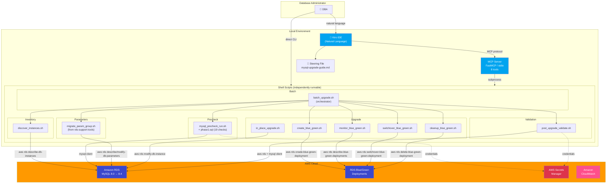
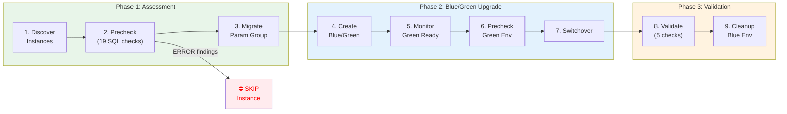
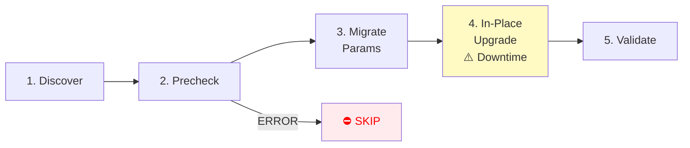
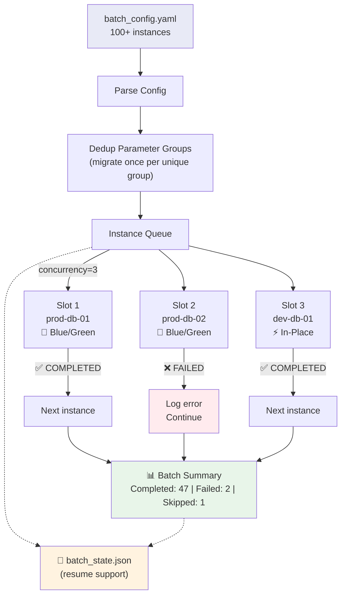

# Architecture Diagrams

Render these Mermaid diagrams at https://mermaid.live or in any Markdown viewer that supports Mermaid.
For the blog, recreate using draw.io with AWS Architecture Icons.

---

## Diagram 1: Solution Architecture

---

## Diagram 2: Upgrade Workflow (per instance)

---

## Diagram 3: Upgrade Workflow (In-Place alternative)

---

## Diagram 4: Batch Orchestration

---

## Diagram 5: Precheck Engine Detail

```mermaid
flowchart TB
    subgraph Phase1["Phase 1 — Read-Only (Safe for Production)"]
        direction TB
        C1["#1 removedSysVars ⏭️ SKIP"]
        C2["#2 sysVarsNewDefaults ⚠️"]
        C3["#3 checkTableForUpgrade → Phase 2"]
        C4["#4 foreignKeyReferences ⚠️"]
        C5["#5 authMethodUsage 🔴/⚠️"]
        C6["#6 pluginUsage 🔴/⚠️"]
        C7["#7 deprecatedDefaultAuth ⏭️ SKIP"]
        C8["#8 deprecatedRouterAuth ⏭️ SKIP"]
        C9["#9 columnDefinition 🔴"]
        C10["#10 sysVarsAllowedValues ⚠️"]
        C11["#11 invalidPrivileges ℹ️"]
        C12["#12 partitionsWithPrefixKeys 🔴"]
        C13["#13 nonInclusiveLanguage ⚠️"]
        C14["#14 memcachedPlugin 🔴"]
        C15["#15 sysSchemaObjects 🔴"]
        C16["#16 dollarSignName ⚠️"]
        C17["#17 reservedKeywords ⚠️"]
        C18["#18 deprecatedTemporalDelimiter 🔴"]
        C19["#19 spatialIndex ⚠️"]
    end

    subgraph Phase2["Phase 2 — CHECK TABLE FOR UPGRADE (Opt-in)"]
        CT["CHECK TABLE ... FOR UPGRADE<br/>on all user tables<br/>⚠️ Acquires metadata locks"]
    end

    Phase1 --> |"generates CHECK TABLE<br/>statements"| Phase2
    Phase1 --> Report["📋 Precheck Report<br/>errors / warnings / notices"]
    Phase2 --> Report

    style Phase1 fill:#E8F5E9
    style Phase2 fill:#FFF9C4
    style Report fill:#E3F2FD
```

